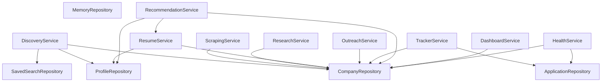

# Hiring Radar — Architectural Blueprint

This document describes the high-level architecture, design decisions, dependency hierarchy, error propagation policies, and persistence design of the Hiring Radar application.

---

## 1. High-Level Architecture

Hiring Radar is structured as a classic layered architecture to enforce **Separation of Concerns** and ensure that all interfaces (CLI, MCP Server, AI Agent, Dashboard, etc.) share the identical business logic.

```
       [ Presentation Layer ] (CLI / MCP Server / AI Agent / Dashboard builder)
                 │
                 ▼
         [ Service Layer ] (Discovery, Scraping, Resume, Outreach, Tracker, etc.)
                 │
                 ▼
       [ Repository Layer ] (Company, Application, SavedSearch, Memory, Profile)
                 │
                 ▼
         [ Database / FS ] (.json databases, YAML config, .env file)
```

1. **Presentation Layer**: Handles user interaction, rendering (Rich tables, panels, progress bars), and translates input parameters into domain models.
2. **Service Layer**: Implements orchestration, business workflows, LLM interactions, SMTP dispatch, and validation. Services are completely decoupled from CLI libraries, printing statements, and standard output.
3. **Repository Layer**: Encapsulates persistence details, serialization (via `orjson`), and file format validation.

---

## 2. Dependency Graph

All service and repository lifecycle creation is centralized in the `ServiceContainer`. Services receive their dependencies explicitly via constructor dependency injection.

```
               ┌───────────────────┐
               │  ServiceContainer │
               └─────────┬─────────┘
                         │
         ┌───────────────┼──────────────┐
         ▼               ▼              ▼
 ┌───────────────┐ ┌───────────┐ ┌──────────────┐
 │  Repositories │ │ Settings  │ │ YamlConfig   │
 └───────┬───────┘ └─────┬─────┘ └──────┬───────┘
         │               │              │
         └───────────────┼──────────────┘
                         │
                         ▼
                  ┌──────────────┐
                  │   Services   │
                  └──────────────┘
```

The relationship between individual repositories and services is shown below:



---

## 3. Service Lifecycle

Services and repositories are wired up and managed by the `ServiceContainer` (located in `app/services/config.py`).

* **Lazy Initialization**: To guarantee fast startup times and avoid premature file I/O or configuration errors, all service instances inside `ServiceContainer` are lazy-initialized via Python properties:
  ```python
  @property
  def discovery_service(self):
      if self._discovery_service is None:
          self._discovery_service = DiscoveryService(...)
      return self._discovery_service
  ```
* **Test Isolation**: The `ServiceContainer` exposes a `reset()` method which clears cached instances and re-resolves settings/user config. This enables unit tests to mock and patch configurations between individual test runs seamlessly.

---

## 4. Repository Responsibilities

Repositories own the persistence and schema structures for all resources:

| Repository Name | Persistent File / Path | Model / Schema Represented |
| :--- | :--- | :--- |
| **`CompanyRepository`** | `output/companies.json` | `list[Company]` |
| **`ApplicationRepository`** | `output/applications.json` | `dict[str, Application]` (keyed by company deduplication key) |
| **`SavedSearchRepository`** | `output/saved_searches.json` | `dict[str, SavedSearch]` (keyed by saved search name) |
| **`MemoryRepository`** | `output/agent_memory.json` | `dict[str, Any]` (AI Agent state and past decisions) |
| **`ProfileRepository`** | `profiles/*.yaml`, `alerts.yaml` | `SearchProfile` (YAML definitions of desired job queries) |

---

## 5. Error & Exception Flow

The application follows a structured exception flow:

1. **Domain-Specific Exceptions** (defined in `app/exceptions.py`) inherit from a common `HiringRadarError` base exception class.
2. Standard exceptions are mixed into domain exceptions where appropriate to preserve backwards-compatibility with tests or caller code. For example:
   * `CompanyNotFoundError` inherits from `HiringRadarError` and `ValueError`.
   * `MultipleCompaniesFoundError` inherits from `HiringRadarError` and `ValueError`.
   * `ResumeError` inherits from `HiringRadarError` and `ValueError`.
3. **Propagation Policy**:
   * Services raise structured domain exceptions.
   * Services never print directly to `stdout`.
   * Presentation layers (CLI subcommands, MCP handlers) catch domain exceptions and map them to appropriate user-facing notifications, Rich error panels, or exit codes.

```
[ Repository ] ➔ raises File/JSON error
                      │
[ Service ]    ➔ catches raw I/O error / performs matching checks ➔ raises Domain Exception
                      │
[ Presenter ]  ➔ catches Domain Exception ➔ prints rich formatting & exit code / logs warning
```
