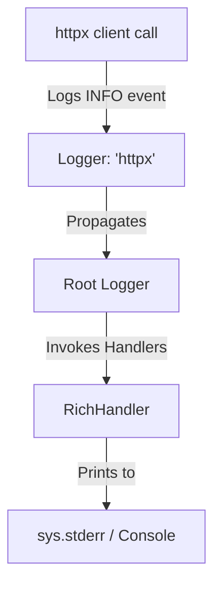

# Logging Audit & Architecture Document

This document outlines the results of the complete audit of the Logging Infrastructure in Hiring Radar (Phase 3.1).

---

## 1. Logging Infrastructure Scanned

The following logging systems and frameworks were identified and audited:

1. **Loguru**: The primary logger used in the application codebase (`app/*`) for application diagnostics, workflow step progress, error capturing, and file tracing.
2. **Python `logging` (Standard Library)**: Used by third-party packages, specifically `httpx`, `httpcore`, `fastmcp`, `urllib3`, and internal abstractions that delegate to python standard loggers.
3. **Rich Logging (`RichHandler`)**: Configured by the `fastmcp` (Model Context Protocol) library under the hood during the import of `mcp_server.server` tools.

---

## 2. Logger Registry & Handlers Scan

| Logger Name | Type / Framework | Default Level | Handlers Registered | Propagate | Description / Purpose |
| :--- | :--- | :--- | :--- | :--- | :--- |
| **Root Logger (`""`)** | Python Standard | `WARNING` (30) | `RichHandler` (added by `fastmcp`) | `True` | The base logger. Custom libraries propagate to it. |
| **`httpx`** | Python Standard | `NOTSET` (0) | None | `True` | Emits HTTP client request/response logs. |
| **`httpcore`** | Python Standard | `NOTSET` (0) | None | `True` | Emits raw connection pool and HTTP pool events. |
| **`mcp`** | Python Standard | `NOTSET` (0) | None | `True` | Emits MCP protocol-specific transaction payloads. |
| **Loguru (`logger`)** | Loguru | `DEBUG` (10) | File Sink (`logs/hiring-radar.log`), Console Sink (`stderr`) | N/A | Handles application and workflow log statements. |

---

## 3. The Log Propagation Leak Path

Before Phase 3.1, standard HTTP request details and library warnings leaked to the terminal because:
1. `app/agent/tools.py` imports `search_jobs` from `mcp_server.server` to register it in the AI tool registry.
2. `mcp_server.server` imports `FastMCP` from the `mcp.server.fastmcp` package.
3. Upon initialization, `FastMCP` calls `logging.basicConfig(level=logging.INFO, handlers=[RichHandler()])` under the hood.
4. This adds a `RichHandler` to the root logger and lowers the root logging level to `INFO`.
5. Any HTTP client call made via `httpx` emits log events at the `INFO` level to the `"httpx"` logger.
6. The `"httpx"` logger propagates the event up to the root logger.
7. The root logger's `RichHandler` captures the event and prints it directly to `sys.stderr` in the terminal.

### The Leak Dependency Graph:

---

## 4. Log Isolation Strategy (Phase 3.1)

To completely silence library outputs and redirect developer logs, the `setup_agent_logging` routine has been hardened:

1. **Clear Root Handlers**: All active handlers attached to the standard `root` logger (specifically `RichHandler`) are dynamically removed on agent startup.
2. **Standard File Redirection**: A `logging.FileHandler` is added to the root logger directing all standard logs to `logs/hiring-radar.log` under `DEBUG`.
3. **Mute Library Loggers**: Library loggers (`httpx`, `httpcore`, `mcp`) are configured with level `WARNING` to block propagation of `INFO` logs during regular REPL modes.
4. **Conditional Verbosity**: When `show_debug_logs=True` is set in `config.yaml`, standard logs are restored to the console using a colored stderr `StreamHandler`.
