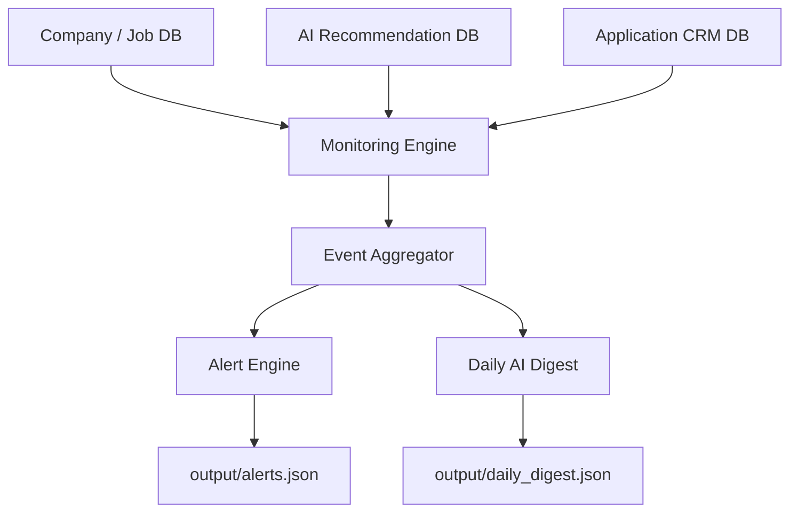

# Hiring Intelligence Monitoring, Alerts & Change Detection Engine

This subsystem continuously evaluates updates across companies, job vacancies, ATS synchronization runs, recommendation engine scores, and candidate CRM application pipelines.

## Architectural Overview

Unlike raw crawlers or scoring engines, the Monitoring subsystem is strictly downstream. It operates as an analysis layer:



---

## Change Event Types

The subsystem registers and handles the following immutable events:

| Event Type | Severity | Trigger Description |
| :--- | :--- | :--- |
| `JobCreated` | Medium | A new job posting is discovered. |
| `JobClosed` | Medium | An existing job vacancy is closed/removed. |
| `RemotePolicyChanged` | High | Hybrid/Remote status is modified. |
| `LocationChanged` | Low | Office or region relocation. |
| `HiringStatusChanged` | High | Overall company ranking score has changed. |
| `EngineeringStackChanged` | Medium | Changes detected in the tech signals stack. |
| `RecruiterChanged` | Low | Recruiter contacts added or removed. |
| `RecommendationChanged` | High | Semantic matching fit score changes. |
| `ApplicationStatusChanged`| High | Interview stage or pipeline status moves. |

---

## Typer CLI Subcommands

A complete set of command-line tools is available under the `hiring-radar monitor` group:

### 1. Execute Monitoring Analysis
Analyzes snapshots and compiles events:
```bash
hiring-radar monitor run
```

### 2. View Detected Change Logs
List all detected pipeline change logs:
```bash
hiring-radar monitor events
```

### 3. Display prioritized Warning Alerts
Group and sort alerts by priority:
```bash
hiring-radar monitor alerts
```

### 4. Show Daily AI Digest Card
Render the compiled daily digest:
```bash
hiring-radar monitor digest
```

### 5. Clear Cache & History
Wipe snapshots and clean states:
```bash
hiring-radar monitor clear-cache
```
