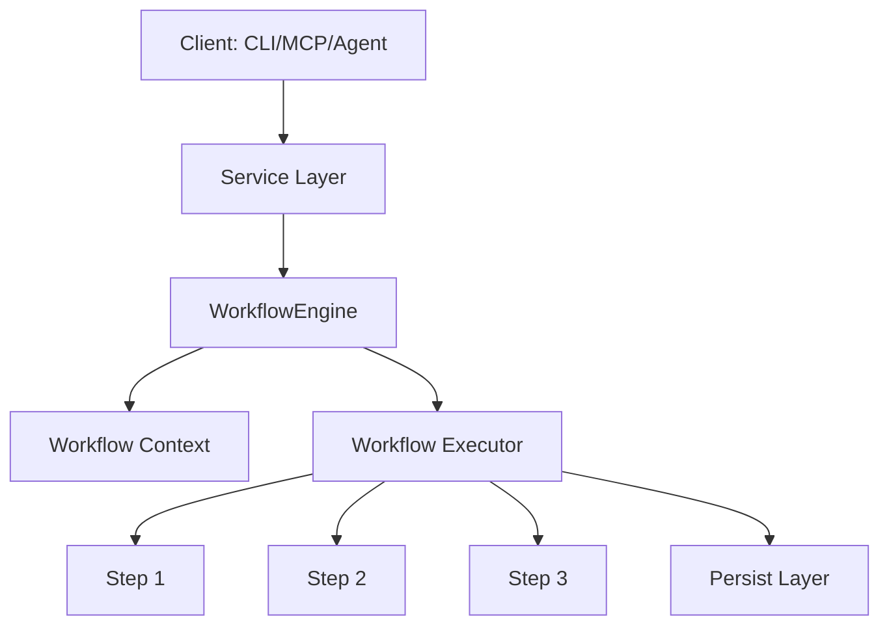

# Workflow Engine & Job Pipeline Architecture

This document describes the design, architecture, and usage of the unified **Workflow Engine** in the Hiring Radar project.

---

## 1. Design Overview

To support multi-client interfaces (CLI, MCP, Agent, Web Dashboards, Scheduler) and allow asynchronous background execution, the codebase uses a pipeline-oriented **Workflow Engine**. 

Instead of services (e.g., `DiscoveryService`, `OutreachService`) calling each other directly and creating tight coupling, all operations are structured as sequential **Workflows** composed of discrete, reusable **Workflow Steps**.



### Key Benefits
* **Decoupled execution**: Services focus purely on their core business logic, delegating orchestrations to pipelines.
* **Telemetry & events**: Fine-grained events (`StepStarted`, `StepFinished`, `WorkflowCompleted`) are published in real time.
* **Cancellation support**: Contexts track `cancelled` status to abort execution gracefully between steps.
* **Thread-safe state**: Context maintains isolated inputs, outputs, and metadata, removing global state reliance.

---

## 2. Core Components

The Workflow Engine lives inside [app/workflows/](file:///c:/Users/91637/Desktop/Business%20Project/hiring-radar/app/workflows/) and consists of:

### `WorkflowContext`
Holds the configuration settings, the `ServiceContainer` instance, progress telemetry, and metadata dictionary for a single execution run.
* Properties:
  * `settings`: System-wide settings.
  * `container`: Services/Repositories registry.
  * `progress`: Telemetry event publisher.
  * `cancelled`: Flag indicating cancellation requests.

### `WorkflowStep`
The base abstract class for all pipeline steps. Each step overrides `execute(context: WorkflowContext)` and returns its resulting output.

### `Workflow`
Orchestrates a series of steps. Defines the execution sequence (`steps`) and overrides `run(context)` to dictate the return value.

### `WorkflowExecutor`
Executes the workflow steps sequentially, checks for cancellation before each step, handles step failures, and fires lifecycle events.

### `WorkflowEngine`
Coordinates the lifecycle, maintains active contexts, registers listeners, and maps aliases to workflow classes.

---

## 3. Supported Pipelines & Workflows

| Alias | Workflow Class | Steps in Order | Return Value |
| :--- | :--- | :--- | :--- |
| `discover` | `DiscoverWorkflow` | `DiscoverStep` &rarr; `ScrapeStep` &rarr; `DeduplicateStep` &rarr; `PersistCompaniesStep` | `list[Company]` |
| `enrich` | `EnrichmentWorkflow` | `LoadCompaniesStep` &rarr; `EnrichStep` &rarr; `PersistCompaniesStep` | `list[Company]` |
| `research` | `ResearchWorkflow` | `LoadCompaniesStep` &rarr; `ResearchStep` &rarr; `PersistCompaniesStep` | `Company` |
| `resume` | `ResumeWorkflow` | `LoadResumeStep` &rarr; `ScoreResumeStep` &rarr; `PersistCompaniesStep` | `dict[str, Any]` (Scoring) |
| `resume_tailor` | `ResumeTailorWorkflow` | `LoadResumeStep` &rarr; `TailorResumeStep` &rarr; `PersistCompaniesStep` | `dict[str, Any]` (Tailoring) |
| `recommend` | `RecommendationWorkflow` | `LoadCompaniesStep` &rarr; `RecommendStep` | `list[dict[str, Any]]` |
| `outreach` | `OutreachWorkflow` | `LoadCompaniesStep` &rarr; `OutreachSubjectStep` &rarr; `OutreachEmailStep` &rarr; `PersistCompaniesStep` | `dict[str, Any]` (Drafts) |

---

## 4. Subscribing to Progress & Telemetry

You can subscribe to execution progress using the `WorkflowProgress` observer:

```python
from app.workflows.progress import WorkflowProgress

progress = WorkflowProgress()

def progress_callback(event_type: str, data: dict):
    if event_type == "advance":
        print(f"Step '{data['step_name']}' is {data['percent']}% done: {data['message']}")

progress.subscribe(progress_callback)

# Pass progress tracker into context
from app.workflows.context import WorkflowContext
context = WorkflowContext(settings=settings, container=container, progress=progress)
```

---

## 5. Lifecycle Events

The engine broadcasts dataclass-based events to all registered listeners. This is ideal for logging, auditing, and triggering secondary actions.

```python
from app.workflows.events import WorkflowStarted, WorkflowCompleted, StepStarted

def log_event(event):
    if isinstance(event, WorkflowStarted):
        print(f"Workflow {event.workflow_name} started (ID: {event.execution_id})")
    elif isinstance(event, StepStarted):
        print(f"Executing step: {event.step_name}")

container.workflow_engine.register_event_listener(log_event)
```

---

## 6. Verification and Unit Tests

Unit tests validating execution order, progress callback propagation, cancellation, and API mocks are implemented in:
* [tests/test_workflow_engine.py](file:///c:/Users/91637/Desktop/Business%20Project/hiring-radar/tests/test_workflow_engine.py)
* [tests/test_discover_workflow.py](file:///c:/Users/91637/Desktop/Business%20Project/hiring-radar/tests/test_discover_workflow.py)
* [tests/test_resume_workflow.py](file:///c:/Users/91637/Desktop/Business%20Project/hiring-radar/tests/test_resume_workflow.py)
* [tests/test_outreach_workflow.py](file:///c:/Users/91637/Desktop/Business%20Project/hiring-radar/tests/test_outreach_workflow.py)
